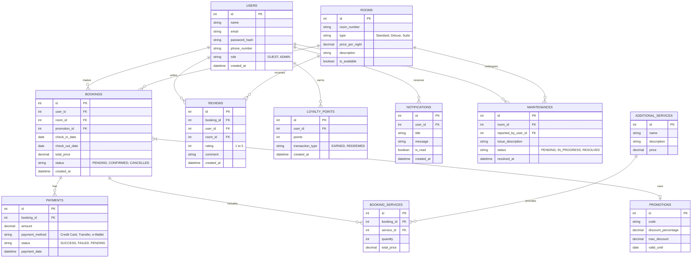

# Product Requirements Document (PRD): Sistem Reservasi Hotel

## 1. Ringkasan Eksekutif
Aplikasi Sistem Reservasi Hotel adalah platform terintegrasi yang dirancang untuk memfasilitasi pemesanan kamar hotel secara online oleh tamu, sekaligus menyediakan alat bantu bagi staf dan manajemen hotel untuk mengelola operasional harian. Platform ini bertujuan untuk meningkatkan tingkat okupansi, menyederhanakan proses pemesanan, dan memberikan pengalaman pengguna yang unggul.

## 2. Tujuan (Objectives)
- **Bagi Pengguna (Tamu):** Memberikan antarmuka yang intuitif untuk mencari, melihat detail, dan memesan kamar hotel dengan cepat dan aman.
- **Bagi Manajemen (Staf/Admin):** Menyediakan sistem manajemen terpusat untuk melacak reservasi, mengelola ketersediaan kamar, dan melihat laporan pendapatan.
- **Tujuan Bisnis:** Meningkatkan konversi pemesanan online sebesar 30% dalam kuartal pertama setelah peluncuran.

## 3. Ruang Lingkup dan Fitur Utama
### 3.1. Fitur Pengguna (Tamu)
1. **Registrasi dan Autentikasi:** Mendaftar, masuk, dan manajemen profil pengguna.
2. **Pencarian dan Filter:** Mencari kamar berdasarkan tanggal *check-in*, *check-out*, tipe kamar, dan rentang harga.
3. **Detail Kamar:** Melihat fasilitas, galeri foto, deskripsi, dan ketersediaan kamar secara *real-time*.
4. **Proses Pemesanan (Booking):** Mengisi detail tamu, memilih metode pembayaran, dan mengonfirmasi reservasi.
5. **Manajemen Reservasi:** Melihat riwayat pemesanan, mengunduh bukti bayar (invoice), dan membatalkan pesanan (sesuai kebijakan).

### 3.2. Fitur Admin (Staf Hotel)
1. **Dasbor Utama:** Ringkasan statistik okupansi, pendapatan, dan pemesanan terbaru.
2. **Manajemen Kamar:** Menambah, mengedit, atau menghapus data kamar, serta memperbarui status ketersediaan.
3. **Manajemen Reservasi:** Mengonfirmasi pembayaran, memodifikasi detail pemesanan, dan memperbarui status reservasi.
4. **Manajemen Pengguna:** Melihat daftar tamu dan mengelola akses staf lain.

## 4. Skema Data & Arsitektur
Arsitektur sistem menggunakan pola *Client-Server* dengan *Frontend* berbasis web (HTML, CSS, JS/Framework) dan *Backend* RESTful API yang terhubung ke database relasional.

### 4.1. Penjelasan Naratif Skema Data
Sistem ini menggunakan struktur data relasional yang berpusat pada entitas-entitas berikut:
- **USERS (Pengguna):** Menyimpan data tamu dan staf hotel. Menggunakan *Role-Based Access Control* (GUEST atau ADMIN) untuk mengatur hak akses.
- **ROOMS (Kamar):** Mewakili data inventaris hotel. Setiap kamar memiliki nomor unik, tipe, harga per malam, dan status ketersediaan.
- **BOOKINGS (Reservasi):** Entitas transaksional yang menghubungkan pengguna dengan kamar. Menyimpan detail *check-in*, *check-out*, total harga, dan status reservasi.
- **PAYMENTS (Pembayaran):** Mencatat riwayat transaksi yang terkait dengan suatu reservasi.
- **REVIEWS (Ulasan):** Menyimpan penilaian dan ulasan dari tamu terkait kamar yang dipesan.
- **ADDITIONAL_SERVICES (Layanan Tambahan):** Katalog layanan berbayar seperti sarapan, spa, atau antar-jemput bandara.
- **BOOKING_SERVICES (Pesanan Layanan):** Tabel perantara untuk mencatat layanan tambahan pada setiap pemesanan.
- **PROMOTIONS (Promosi):** Data kupon/diskon yang dapat digunakan oleh tamu saat pembayaran.
- **MAINTENANCES (Pemeliharaan):** Catatan perbaikan dan pengecekan kondisi kamar oleh staf.
- **LOYALTY_POINTS (Poin Loyalitas):** Sistem poin hadiah untuk tamu setia.
- **NOTIFICATIONS (Notifikasi):** Pesan pemberitahuan sistem kepada pengguna (misal: pengingat *check-in*).

### 4.2. Visualisasi ERD (Entity Relationship Diagram)
Berikut adalah struktur relasi antar entitas yang mendasari sistem database:

## 5. Persyaratan Non-Fungsional (Non-Functional Requirements)
1. **Keamanan (Security):** Semua *password* harus di-hash (misal menggunakan bcrypt). Komunikasi API harus melalui HTTPS.
2. **Kinerja (Performance):** Waktu muat halaman tidak boleh lebih dari 3 detik pada koneksi internet standar (4G).
3. **Skalabilitas (Scalability):** Sistem harus mampu menangani minimal 500 transaksi pemesanan secara bersamaan tanpa degradasi performa.
4. **Responsivitas (Responsiveness):** Antarmuka pengguna harus sepenuhnya *mobile-responsive* untuk mengakomodasi akses dari *smartphone* dan tablet.

## 6. Milestone dan Fase Peluncuran
- **Fase 1: Desain & Prototyping (Minggu 1-2)** - UI/UX mockup, persetujuan ERD, dan spesifikasi API.
- **Fase 2: Pengembangan Inti (Minggu 3-5)** - Setup database, autentikasi pengguna, dan modul pemesanan dasar.
- **Fase 3: Integrasi Pembayaran & Dasbor Admin (Minggu 6-7)** - Gateway pembayaran dan fitur CRUD untuk manajemen hotel.
- **Fase 4: Testing & UAT (Minggu 8)** - *User Acceptance Testing*, perbaikan *bug*, dan optimasi performa.
- **Fase 5: Peluncuran (Minggu 9)** - Deployment ke lingkungan *production*.
